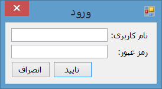
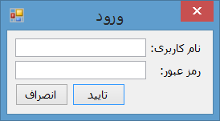

#RTL Panel

When creating RTL windows applications for languages like persian, arabic or hebrew, to have both text flow and control placements as right-tol-left, both `RightToLeftLayout` and `RightToLeft` properties usually are set to true. 
This way also the form title bar will be mirrored and control box will be shown at left:

But in most cases users are using LTR windows and having a windows which shows close button at left is not user-friendly for most  users.

If you don't like to have right to left title bar and the control box at left, you should create your right to left container yourself and put controls in it and then set `RightToLeftLayout` of the container to true and set `RightToLeft` of the container to yes to have a complete right to left layout in the container without changing the layout of title bar and control box:

To do so, we can add `WS_EX_LAYOUTRTL` and `WS_EX_NOINHERITLAYOUT` styles to the panel wehn craeting the panel:

    protected override CreateParams CreateParams
    {
        get
        {
            CreateParams CP;
            CP = base.CreateParams;
            if (this.RightToLeftLayout &&
                this.RightToLeft == System.Windows.Forms.RightToLeft.Yes)
                CP.ExStyle = CP.ExStyle | WS_EX_LAYOUTRTL | WS_EX_NOINHERITLAYOUT;
            return CP;
        }
    }